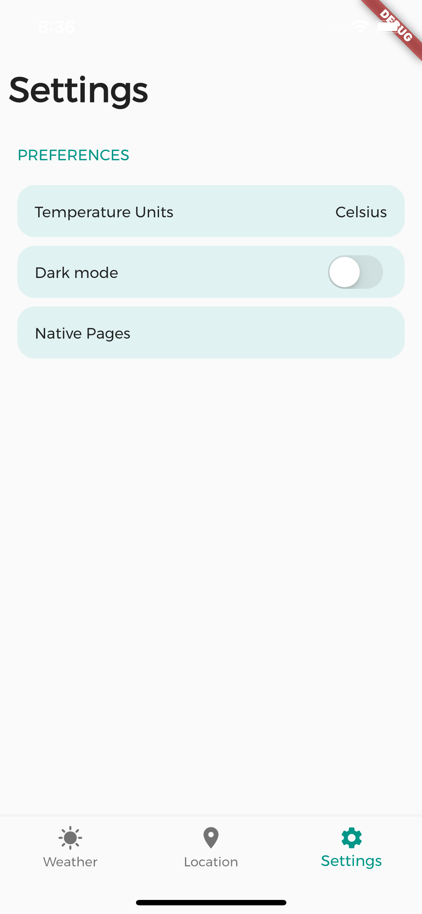

# Weather Forecast App

Weather forecast app that fetch OpenWeather Rest Api and shows the current weather and future 5 day forecast for the location you selected.
The default location is London but can be changed in the Location page.
To access the native webview, go to settings and then "Native pages"


<section>




</section>


## Features
 - Current day weather
   - Wind speed
   - Rain probability
   - Min, current and max temperatures
   - Humidity percentage
   - Sunrise time
   - Sunset time
   - Hourly forecast step

 - Next 5 days forecasts
 - Update used units (metric,imperial,standard)
 - Dark mode
 - Native page of OpenWeather


## Installation

Clone this repository and run

## Usage

```dart
flutter pub get
flutter run
```


## Fun fact
4 Energy drink were consumed in the making of this app

6 Hours between 4 days were used to sleep

15 StackOverflow tabs were opened at max in one window to complete this challenge

I said "Oh god what have I done" only once

You can tell the temperature by counting a cricket’s chirps
   


#### Made by Cristian Bregant during the easter holidays.

## License
[MIT](https://choosealicense.com/licenses/mit/)